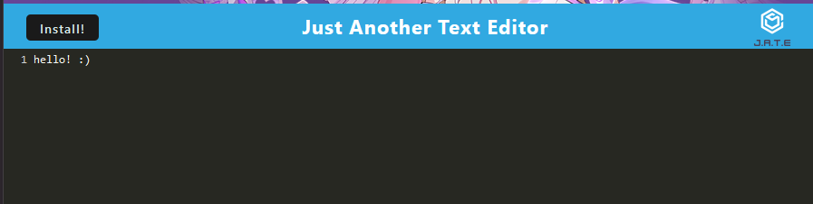

# <PWA-Text-Editor>

## Description

The goal of this project was to finish the starter code provided in order to deploy a fully working Progressive Web Application (PWA) text editor. It uses IndexDB to store the data and webpack to build the bundle.

## Installation

Go to the deployed app [here](https://rocky-depths-96442-cd89cd6fcd5d.herokuapp.com/) and click the install button

## Usage

Simply go to the deployed app [here](https://rocky-depths-96442-cd89cd6fcd5d.herokuapp.com/). From there you can either use it in browser or install it.

## Credits

This project was created with starter code from the KU Full Stack Web Development course. I completed the project referencing our in class instruction.

## License

Please see license in GitHub repo